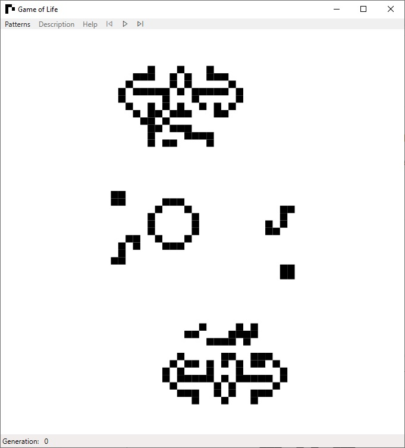

# Game of Life

This is a .Net implementation of Conway's Game of Life cellular automaton. It is a WPF application built in the MVVM (Model-View-ViewModel) architecture. It supports loading patterns from .lif files with 1.05 and 1.06 formats.

To load the project in Visual Studio, navigate to the GameOfLife.View.Presentation directory and open the GameOfLife.sln file.

## Extra features to be added
- [X] Toggle cell on click (while paused)
- [ ] Create new pattern with a given size
- [ ] Create random pattern with a given size
- [ ] Show description of the current loaded pattern
- [ ] Save current pattern to Life 1.06 format
- [ ] Create a help popup
- [ ] Step backwards (Save previous states)

  

